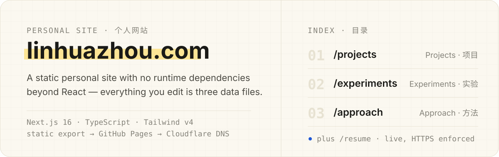
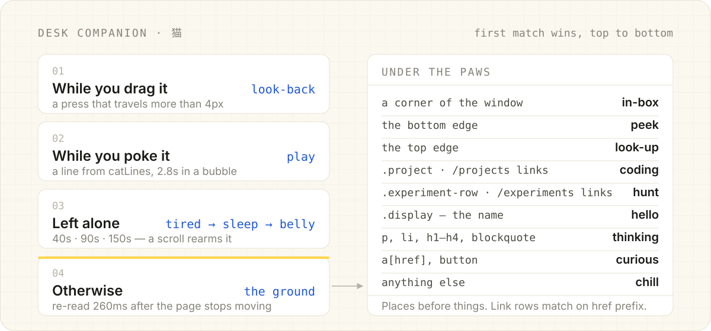
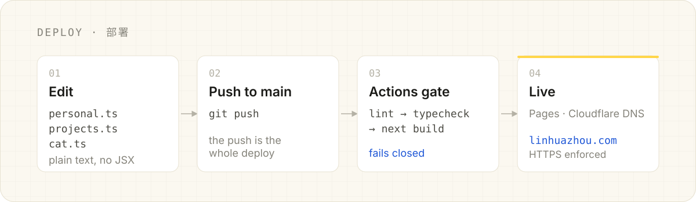

<p align="center">
  
</p>

<p align="center">
  <a href="https://linhuazhou.com"><strong>linhuazhou.com</strong></a> ·
  <a href="#what-you-edit">What you edit</a> ·
  <a href="#the-cat">The cat</a> ·
  <a href="#how-a-change-ships">How it ships</a> ·
  <a href="#project-structure">Structure</a>
</p>

---

The personal site of **Linhua Zhou** — software engineering, AI and agent systems,
developer tools, and product work.

It is a **compact landing hub** with three pages behind it, not one long scroll.
The point of the build is maintenance: the content you actually change lives in
plain data files, so adding a project — or teaching the cat a new pose — never
means opening a component.

- **Live** — [linhuazhou.com](https://linhuazhou.com)
- **Pages** — `/` hub · `/projects` · `/experiments` · `/approach` · `/resume`
- **Build** — Next.js 16 App Router, `output: "export"` — fully static
- **Runtime dependencies** — React and React DOM. Nothing else.

No CMS, no database, no analytics, no third-party requests at runtime. The page renders
entirely from its own origin, which also keeps it reachable from mainland China.

---

## Quick start

```bash
npm install
npm run dev          # http://localhost:3000
```

Before you push:

```bash
npm run lint         # ESLint
npm run typecheck    # tsc --noEmit
npm run build        # static export into out/
```

`npm run build` writes the deployable site to `out/`. To preview that exact output:
`npx serve out`.

---

## What you edit

Three files hold everything. None of them contains JSX.

### `src/data/personal.ts` — who the site is about

| Export | Controls |
| --- | --- |
| `site` | Canonical URL, page title, meta description, share image, locale |
| `identity` | Name, `nameAlt` (secondary script), the `Developer · Builder` line, year |
| `places` + `currentPlace` | The live clock in the header — see below |
| `hero` | The Now block (two status rows), intro paragraph, status chip |
| `links` | Email · GitHub · LinkedIn · Résumé · X — label, URL, and handle |
| `about` | About paragraphs and the spec-sheet facts beside them |
| `footer` | The one-line footer note |

**The Now block** sits between the name and the paragraph, and it is the one thing on the
site that goes stale — keep it current. Two rows read best; a `href` turns a row into a
link. Labels want ten characters or fewer, values sixty or fewer.

```ts
now: [
  { label: "Now", value: "…", href: "https://asterlo.io" },
  { label: "Next", value: "…" },
],
```

**Links.** `kind` selects the icon — `"github" | "linkedin" | "x" | "resume" | "email"`.
Delete an entry and its cell leaves the strip. To add a new kind, add an icon to
`src/components/icons.tsx` and register it there. The email entry deliberately points at
Gmail's compose URL rather than `mailto:`, so it opens a working compose window instead of
handing off to a desktop client that may not exist; `handle` keeps the bare address.

**The clock.** The header shows the real local time wherever you are. Nothing detects
anything — you change one line when you move:

```ts
export const currentPlace: PlaceKey = "dc";   // a key of `places`
```

`zone` is the IANA identifier and does the arithmetic, including daylight saving. `label`
is only what a reader sees, which is why `dc` can print "Washington, D.C." while running on
`America/New_York`. A key that isn't in `places` fails `npm run typecheck`, and an invalid
zone identifier throws during prerender — so neither reaches the site.

### `src/data/projects.ts` — the work

Three exports: `categories` (the six kinds of work), `projects` (`/projects`), and
`experiments` (`/experiments`). Add a project by copying an object:

```ts
{
  slug: "my-app",
  title: "My App",
  description: "One or two sentences. The problem, and why it was worth solving.",
  category: "ai-products",          // ai-products | web | developer-tools
  year: "2026",                     // experiments | open-source
  status: "Live",                                // optional chip
  tech: ["TypeScript", "Next.js"],               // optional
  metrics: [{ label: "Users", value: "1.2k" }],  // optional stat row
  githubUrl: "https://github.com/…",             // optional
  liveUrl: "https://…",                          // optional
  images: [
    { src: "/projects/my-app/main.png", alt: "The My App dashboard" },
    { src: "/projects/my-app/secondary.png", alt: "The settings screen" },
  ],
}
```

Only `slug`, `title`, `description`, `category` and `year` are required — leave a field out
and the layout closes up around it. `placeholder: true` draws the dashed **Placeholder**
chip; delete that line once the entry describes something real.

**Screenshots** go in `public/projects/<slug>/` as `main.png`, `secondary.png`,
`tertiary.png`. Overwrite a file at the same path and the site picks it up — no code change.
The first image sits in front and the next two peek out behind it, so two or three look
best. Landscape, around 1600×1000, a few hundred KB.

### `src/data/cat.ts` — the desk companion

Everything the cat says and does, in one table. It has its own section below.

---

## The cat

<p align="center">
  
</p>

A small companion pinned over every page: drag it anywhere, poke it for a line, and
otherwise ignore it while it dozes off. Fifteen drawings, exactly one visible at a time.

**Nothing sets its pose.** Four independent facts are tracked and the drawing is derived
from them, so no pair of events can race to decide what the cat looks like:

```ts
const pose = dragging ? "look-back" : line ? "play" : (idle ?? ground);
```

The last of those — `ground` — is the resting state and the only one most visitors see
change. It is a hit test at the bottom centre of the widget's box, which is where the cat's
feet actually are, resolved through `catGround` in first-match order. Places are checked
before things, so a cat in a corner is in its box whatever the page has drawn there:

| Under the paws | Pose |
| --- | --- |
| a corner of the window (within `catEdges.corner`) | `in-box` |
| the bottom edge | `peek` |
| the top edge | `look-up` |
| `.project`, `a[href^="/projects"]` | `coding` |
| `.experiment-row`, `a[href^="/experiments"]` | `hunt` |
| `.display` — the name in the hero | `hello` |
| `p`, `li`, `h1`–`h4`, `blockquote` | `thinking` |
| `a[href]`, `button` | `curious` |
| anything else | `chill` |

The ground changes two ways, and both are the visitor's own doing: you drag the cat
somewhere, or you scroll the page underneath it. A scroll re-reads the ground only after
`catDwellMs` of stillness — without that hysteresis the pose would strobe at every boundary
a moving page drags past.

**What you edit** in `src/data/cat.ts`:

| Export | Controls |
| --- | --- |
| `CatPose` | The fifteen names, which are also the sprite file names |
| `catLines` | What it says when you poke it — picked at random, never twice in a row |
| `catEdges` | The `corner` / `bottom` / `top` bands, in px from the window's own edges |
| `catGround` | The selector → pose table above. First match wins, so specific goes first |
| `catDwellMs` | How long new ground must hold before the cat answers it (260 ms) |
| `catBubbleMs` | How long a line stays up (2800 ms) |
| `catIdle` | The idle ladder — `tired` at 40 s, `sleep` at 90 s, `belly` at 150 s |

A selector that stops matching costs a pose, not a crash: unrecognised ground is floor, and
the cat lies down on it.

**Rules that keep it a footnote.** No cat at all without `(hover: hover) and (pointer: fine)`
— a companion you cannot hover or drag is just a picture in the way. It is `aria-hidden` and
out of the tab order. Sending it away leaves a faint `>_ cat` in the corner to fetch it back,
because dismissing something with no visible way back is a trap. The perch and the dismissal
live in `localStorage` (`cat-perch`, `cat-dismissed`), so it stays where you put it across
routes, reloads and tabs.

**The artwork.** `assets/cat-source.png` is one sheet of fifteen drawings on a cream
background. `scripts/make-cat-sprites.py` keys that background out by flood-filling inward
from the sheet's edges — a fill that has to *reach* a pixel can tell cream behind the cat
from cream on it — reduces each crop to its largest connected component to drop the loose
hearts and zzz's, then writes `public/cat/<pose>.webp` and the intrinsic sizes in
`src/data/cat-sprites.json`. Pillow only, no network:

```bash
python3 scripts/make-cat-sprites.py   # only when the source sheet changes
```

---

## How a change ships

<p align="center">
  
</p>

Pushing to `main` is the deploy — [`.github/workflows/deploy-pages.yml`](.github/workflows/deploy-pages.yml)
does the rest. The workflow fails on a lint or type error **before** it builds, so a broken
commit never reaches production.

Repository setup, already in place:

- Settings → Pages → Source: **GitHub Actions**
- Custom domain `linhuazhou.com`, **Enforce HTTPS** on
- Cloudflare DNS: four `A` records to GitHub Pages plus a `CNAME` for `www`, all
  **DNS only** (grey cloud) so Pages can issue and renew its certificate

`public/CNAME` keeps the custom domain attached on every deploy — do not delete it.
`public/.nojekyll` stops Pages from filtering `_next/`.

Because the site is served from the domain root, there is **no `basePath`**. Moving it to
`https://<user>.github.io/<repo>/` would require adding `basePath` and `assetPrefix` to
`next.config.ts`.

---

## Project structure

```
src/
  app/
    layout.tsx        metadata, font preload, click ripple, the cat
    page.tsx          the landing hub
    projects/ experiments/ approach/   the three content pages
    work/ lab/ about/                   redirect stubs for the old URLs
    globals.css       design tokens + every component style
    not-found.tsx     404
    robots.ts  sitemap.ts  icon.png
  components/         small, single-purpose pieces
    cat-companion.tsx the desk companion — drag, poke, doze
    command-deck.tsx  the background artwork and its pointer parallax
  data/
    personal.ts       ← you edit this
    projects.ts       ← and this
    cat.ts            ← and this
    cat-sprites.json  generated by the sprite script — not hand-edited
  lib/
    smooth-damp.ts    critically damped smoothing, shared by the deck and the cat
    cat-ground.ts     what the paws have landed on
    cat-presence.ts   who gets a cat, and whether it is currently around
public/               static assets, copied verbatim into out/
  cat/                the fifteen sprites (generated)
  backgrounds/        the two command-deck layers
  fonts/              Geist + Geist Mono, self-hosted
scripts/              sprite and cursor generators — build-time only, never shipped
assets/               cat-source.png, plus readme/ artwork (not part of the site build)
```

The page is a centred **1040px column** (`--shell`) with wide gutters, so it stays composed
instead of stretching on large displays. Change `--shell` and `--gutter` in `globals.css` to
resize the whole site at once; `--measure` (62ch) caps line length for prose.

<details>
<summary><strong>Design tokens</strong> — the palette in <code>globals.css</code></summary>

<br>

Tailwind CSS v4, configured entirely in CSS via `@theme`. No `tailwind.config.js`.

| Token | Value | Role |
| --- | --- | --- |
| `--color-ink` | `#1a1a17` | Warm near-black type |
| `--color-paper` | `#fbf8f0` | Page ground (warm cream) |
| `--color-paper-2` | `#ffffff` | Raised surfaces — cards, screenshots |
| `--color-line` | `#e7e2d2` | Warm hairlines |
| `--color-accent` | `#1f57d6` | Links, focus, small marks only |
| `--color-marker` | `#ffd64a` | Highlighter swipe — background only, never type |
| `--color-grid` | `rgb(26 22 10 / 0.045)` | Engineering graph-paper ruling |

Type is self-hosted **Geist** and **Geist Mono** (variable `.woff2`, SIL OFL, included in
`public/fonts/`). `Geist-Variable.woff2` is preloaded in `layout.tsx`.

</details>

<details>
<summary><strong>The atmospheric bits</strong> — deck, reveals, cursor, ripple</summary>

<br>

**Command deck.** The "futuristic control interface" behind the hero is two original SVGs in
`public/backgrounds/` — a structure layer and a data layer. They are masked into the page and
carry no meaning, so the site reads identically without them. One token controls intensity:

```css
:root { --deck-opacity: 0.34; }
```

The two layers drift apart under the pointer, and the gap between them is what reads as
depth. The offsets are integrated with `smoothDamp` (Unity's SmoothDamp, `src/lib/smooth-damp.ts`)
rather than eased by a CSS transition: a transition's duration is fixed regardless of
distance and restarts from zero on every new target, while a velocity gives the motion mass —
it leans into a move, trails a fast one, and coasts to rest. The rAF loop shuts itself off
once both layers settle. This is the only pointer listener on the site: passive, fine-pointer
only, skipped entirely under reduced motion.

**Scroll reveals.** Sections rise and fade in on a scroll-driven timeline
(`animation-timeline: view()`) — pure CSS, no observers and no JavaScript. The fade finishes
before the rise so the words are readable while the element is still settling. Cards sharing
a grid row would otherwise arrive in unison, so `.stagger` offsets every second column by a
few percent of its entry range, which reads as a ~100 ms stagger. Where the browser has no
scroll timelines, content is simply visible.

**Cursor.** A real CSS cursor via `image-set()`, not a JS element chasing the mouse — so it
never lags. Artwork is `public/cursor*.png`, generated by `scripts/make-cursor.py`.

**Click ripple.** `src/components/click-ripple.tsx` draws the blue ripple on click. One fixed
layer appended to `<body>`, `aria-hidden` and `pointer-events: none`; each ring removes itself
on `animationend`, so a click storm leaves nothing behind.

All motion sits behind `@media (prefers-reduced-motion: no-preference)`. With reduced motion
enabled the site is static and complete.

</details>

---

## Switches left open

- `identity.nameAlt` is `""`. Set it back to `"周琳桦"` to restore the secondary script in
  the hero, the footer, and the JSON-LD `alternateName` — one switch drives all three.
- `hero.now` is the one field that goes stale by design. Re-read it when you push.

---

## License

Code is free to learn from. The content — writing, project descriptions, images — and the
Geist fonts (SIL Open Font License, `public/fonts/GEIST-LICENSE.txt`) are excluded.
